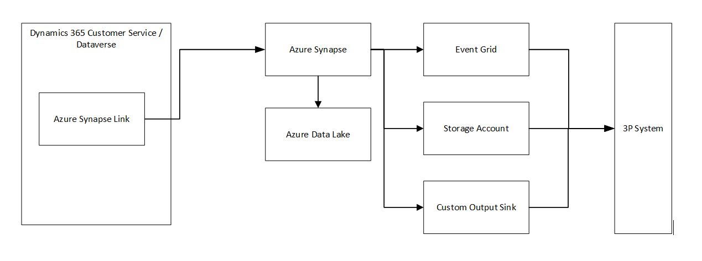

# Historic export integration with Dynamics 365 Customer Service

## In this article

- [Introduction](#introduction)
- [Prerequisites](#prerequisites)
- [Demo architecture & overview](#demo-architecture--overview)
- [Setup](#setup)
  - [Create an Azure Data Lake Storage Gen2](#create-an-azure-data-lake-storage-gen2)
  - [Create a Synapse workspace](#create-a-synapse-workspace)  
  - [Connect Dynamics 365 Customer Service to Synapse Workspace](#connect-dynamics-365-customer-service-to-synapse-workspace)
    - [View your data in Azure Synapse Analytics](#view-your-data-in-azure-synapse-analytics)
  - [Import and run sample PySpark scripts](#import-and-run-sample-pyspark-scripts)
  - [Connecting to storage accounts in a different AAD tenant](#how-to-connect-azure-synapse-workspace-to-storage-account-if-they-are-in-different-azure-active-directory-tenant)
    - [Using managed endpoint](#using-managed-endpoint)
    - [Using managed identity](#using-managed-identity)
    - [Using storage account key](#using-storage-account-key)

## Introduction

This article shows how to integrate with Dynamics 365 Customer Service to retrieve historic data and transform it using a Synapse Workspace.

[Return to top](#in-this-article)

## Sample code

The sample code for this topic is located in the [GitHub code repository](https://github.com/microsoft/dynamics365-customerservice-wem-samples/tree/main/src/3rdPartyIntegration/Export/Historical) under `src/3rdPartyIntegration/Export/Historical` folder.

[Return to top](#in-this-article)

## Prerequisites

In order to run this demo, you need the following prerequisites:

- An active Dynamics 365 Customer Service org with Omnichannel installed. You must have `System Administrator` permissions on this org.
- An active Azure subscription. You must have permissions to create resources in this subscription.

[Return to top](#in-this-article)

## Demo Architecture & overview

The included demo demonstrates how to use **Azure Synapse Link** to connect your Dynamics 365 Customer Service organization to Azure Synapse Analytics and transform your data using [PySpark](https://spark.apache.org/docs/latest/api/python/index.html) scripts. Azure Synapse Link is a service that enables you to export data from Dataverse to [Azure Data Lake Storage Gen2](https://learn.microsoft.com/azure/storage/blobs/data-lake-storage-introduction) and [Azure Synapse Analytics](https://azure.microsoft.com/products/synapse-analytics) without affecting the performance of your operational applications. You can use Azure Synapse Analytics to perform advanced analytics and machine learning on your data, as well as integrate it with other data sources in your data lake.

In the included demo, we show you how to setup the export in the [PowerApps Maker portal](https://make.powerapps.com/) to export the data from Dataverse to a storage account. You can then use the included [Jupyter Notebook](https://jupyter.org/) to process the data. The included notebook uses PySpark as the scripting language, but you can use any language supported in Synapse Workspace to process the data, if needed.

The diagram below displays the high level overview of the setup:

[Return to top](#in-this-article)

## Setup

To setup the the demo, perform the following steps:

1. [Create an Azure Data Lake Storage Gen2](#create-an-azure-data-lake-storage-gen2).
1. [Create a Synapse workspace](#create-a-synapse-workspace).
1. [Connect Dynamics 365 Customer Service to Synapse Workspace](#connect-dynamics-365-customer-service-to-synapse-workspace).
1. [Import and run sample PySpark scripts](#import-and-run-sample-pyspark-scripts)

> **Note**
>
> The storage account and Synapse workspace must be created in the same region and tenant as the Dynamics 365 Customer Service environment you will use the feature in and the same resource group. Using private endpoints for storage account or Synapse workspace isn't supported.

> **IMPORTANT**
> Creating Azure resources will incur cost. Different Azure resources have different cost associated with them. Please refer to the Azure billing documentation for the specific resource, to estimate costs that may be incurred. It is recommended that you delete the resources as soon as you are done with the demo, to minimize cost. Some Azure resources incur cost even if you do not use them actively.

### Create an Azure Data Lake Storage Gen2

First, you will need to create an Azure Data Lake Storage Gen2 account. The storage account must be enabled for **Hierarchical namespace** and **public network access** for both initial setup and delta sync. Allow storage account key access is required only for the initial setup.

To create a storage account for Azure Data Lake Storage Gen2, follow these steps:

1. Navigate to the [Azure portal](https://portal.azure.com), and at the top search for `storage`. In the search results, under Services, select **Storage accounts**.

1. Click on **Create**.

1. On the **Basics** tab, select your subscription, resource group, and a unique name for your storage account. Storage account names must be between 3 and 24 characters in length and may contain numbers and lowercase letters only.

1. Select **Standard** or **Premium** for performance, depending on your performance requirements. For more information, see [Storage account setup overview](https://learn.microsoft.com/azure/storage/common/storage-account-overview).

1. Select the appropriate redundancy. For demo purposes, you may select `Locally-redundant storage (LRS)`, which will be the least expensive option. For more information, see [Storage redundancy](https://learn.microsoft.com/azure/storage/common/storage-redundancy).

1. On the **Advanced** tab, check the **Enable hierarchical namespace** checkbox.

1. Click on **Create** button to create your storage account.

For more information, see [Create data lake storage account](https://learn.microsoft.com/azure/storage/blobs/create-data-lake-storage-account).

[Return to top](#in-this-article)

### Create a Synapse workspace

Next, you will setup a Synapse Workspace with the Synapse Administrator role access within the Synapse Studio. The Synapse workspace must be in the same region as your Azure Data Lake Storage Gen2 account with allowAll IP addresses access rule. The storage account must be added as a linked service within the Synapse Studio.

To create a Synapse workspace, follow these steps:

1. Navigate to the [Azure portal](https://portal.azure.com), and at the top search for **Synapse**. In the search results, under Services, select **Azure Synapse Analytics**.

1. Click on **Create** to create a new workspace.

1. On the **Basics** tab, select your subscription, resource group, and a unique name for your workspace.

1. On the **Data lake storage account details** section, select your storage account and container that you created in the previous step.

1. On the **Connectivity settings** section, select an option that meets your security needs. For more information, see [Synapse workspace connectivity settings](https://learn.microsoft.com/azure/synapse-analytics/security/synapse-workspace-connectivity-settings).

1. Review the other settings in the **Security**, **Tags**, and **Review + create** tabs, and modify them as needed.

1. Select **Create** to create your workspace.

For more information, see [Quickstart to create a Synapse workspace](https://learn.microsoft.com/azure/synapse-analytics/quickstart-create-workspace).

[Return to top](#in-this-article)

### Connect Dynamics 365 Customer Service to Synapse Workspace

To connect your Connect Dynamics 365 Customer Service organization to your Synapse Workspace, follow these steps:

1. Sign in to [PowerApps Maker Portal](https://make.powerapps.com) and select your preferred environment.

1. On the left navigation menu bar, click on **Azure Synapse Link**. If this menu item is not available, then click on the **More** menu item, to reveal additional items.

1. Click on **New link**.

1. Select your Azure subscription, resource group, storage account, and container where you want to store your data. Click on **Next**.

1. Select the tables that you want to sync.

1. (Optional) Click on the **Advanced** chevron, to allow configuring the partition and incremental updates.

1. Click on **Save**.

1. Wait for the link profile creation to complete.

For more information on Azure Synapse Link for Dataverse, and to learn about the various options, see [Azure Synapse Link Overview](https://learn.microsoft.com/power-apps/maker/data-platform/export-to-data-lake).

[Return to top](#in-this-article)

#### View your data in Azure Synapse Analytics

To view your data in Azure Synapse Analytics, follow these steps:

1. Sign in to [Azure portal](https://portal.azure.com) and navigate to your Synapse workspace.

1. Click on the **Synapse Studio** link on the overview page.

1. Navigate to **Data** > **Linked** and expand your storage account and container where you store your Dataverse data.

1. You can see various folders corresponding to different Dataverse tables. Each folder contains Comma Separated Values (csv) files that store the table data.

1. You can use various tools within the Synapse Studio such as SQL Serverless, Spark notebooks, Power BI, etc., to query, analyze, visualize, or transform your Dataverse data.

> **NOTE**
> The data stored in the data lake is in the Common Data Model (CDM) format. To learn more on CDM, please see the [Common Data Model](https://learn.microsoft.com/common-data-model/) page.

[Return to top](#in-this-article)

### Import and run sample PySpark scripts

A PySpark script is a Python code that runs on Apache Spark, a distributed computing framework for large-scale data processing. The included demo code contains a Jupyter Notebook, that contains PySpark script fragments that you can use to process the exported data.

To import the notebook, perform the following steps:

1. Download the sample notebook from [Sample notebook](https://github.com/microsoft/dynamics365-customerservice-wem-samples/src/3rdPartyIntegration/Export/Historical/SampleNotebook.ipynb)

1. Open Synapse Studio for your workspace.

1. Go to the Object Explorer in Synapse Studio and select Notebooks.

1. Click on the **Import** button on the top right corner of the screen.

1. Browse to the location of the notebook file. The file should have the `.ipynb` extension, which is the standard Jupyter Notebook format.

1. Enter a name for the notebook and optionally select a folder to store it in.

1. Click on Import to upload the notebook to your Synapse Workspace.

1. In the notebook toolbar, select a Spark pool to run your code. If you don't have one, you can create one by following the steps in [Create spark pool](https://docs.microsoft.com/azure/synapse-analytics/spark/apache-spark-pool-create-portal) page.

1. Run the first cell by clicking on the **Run cell** button or pressing **Shift+Enter**. You should see a table with one column named `value` that contains the lines of the text file.

1. You can run any of the sample scripts in the code cells to transform the data by selecting the cell and click **Run cell** or pressing **Shift+Enter**.

[Return to top](#in-this-article)

### How to connect Azure Synapse Workspace to Storage account if they are in different Azure Active Directory tenant

There are multiple methods that may be used to connect your Azure Synapse Workspace to a storage account that exists in another Azure Active Directory (AAD) tenant.

#### Using managed endpoint

Step 1: Create a managed private endpoint connection request to the storage account

1. In Azure portal, navigate to your **Synapse workspace** and select **Manage**.

1. Under External connections, select **Managed private endpoints**.

1. Select New to create a new managed private endpoint.

1. Enter a name for the endpoint, such as `storage1-endpoint`.

1. Select Azure Storage as the target resource type and Blob storage as the target sub-resource type.

1. Select your storage account from the list of available resources and select **Create**.

Step 2: Approve the managed private endpoint connection request

1. In Azure portal, navigate to your storage account and select **Private endpoint connections** under Settings.

1. Select the pending connection request and select **Approve**.

1. Enter a description (optional) and select **Yes**.

Step 3: Add an exception for your Synapse workspace in the storage account firewall settings

1. In Azure portal, navigate to your storage account and select **Networking under Settings**.

1. In the Resource instances section, select Microsoft.Synapse/workspaces as the Resource type and enter your workspace name for Instance name.

1. Select **Save**.

#### Using managed identity

Step 1: Grant the managed identity permissions to the storage account

1. In Azure portal, open the primary storage account chosen for your workspace.

1. Select **Access control (IAM)**.

1. Select **Add** > **Add role assignment** to open the Add role assignment page.

1. Assign the Storage Blob Data Contributor role to the managed identity of your workspace. Note that the managed identity name is also the workspace name.

1. Select **Save**.

Step 2: Create a managed private endpoint connection request to the storage account

1. In Azure portal, navigate to your Synapse workspace and select **Manage**.

1. Under External connections, select **Managed private endpoints**.

1. Select **New** to create a new managed private endpoint.

1. Enter a name for the endpoint, such as `storage1-endpoint`.

1. Select **Azure Storage** as the target resource type and Blob storage as the target sub-resource type.

1. Select your storage account from the list of available resources and select **Create**.

Step 3: Approve the managed private endpoint connection request

1. In Azure portal, navigate to your storage account and select **Private endpoint connections** under Settings.

1. Select the pending connection request and select **Approve**.

1. Enter a description (optional) and select **Yes**.

#### Using storage account key

Step 1: Get the storage account key

1. In Azure portal, open the storage account that you want to add to your Synapse workspace, such as `storage2`.

1. Select **Access keys** under Settings.

1. Copy the connection string of either key1 or key2.

Step 2: Link the storage account to your Synapse workspace

1. In Azure portal, navigate to your Synapse workspace and select **Manage**.

1. Under External connections, select **Linked services**.

1. Select **New** to create a new linked service.

1. Select Azure Blob Storage as the data store type and select **Continue**.

1. Enter a name for the linked service, such as `storage2-linked`.

1. Under Account selection method, select **From connection string**.

1. Paste the connection string that you copied in step 2 and select **Test connection** to verify that it works.

1. Select **Create**.

[Return to top](#in-this-article)