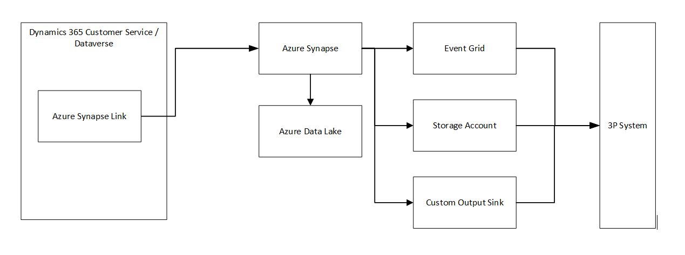

# Historic data integration with Dynamics 365 Customer Service

## In this article

- [Introduction](#introduction)
- [Prerequisites](#prerequisites)
- [Demo architecture & overview](#demo-architecture--overview)
- [Setup](#setup)
  - [Create a storage account for Azure Data Lake Storage Gen2](#create-a-storage-account-for-azure-data-lake-storage-gen2)
  - [Create a Synapse workspace](#create-a-synapse-workspace)
  - [Deploy the Function App](#deploy-the-function-app)
  - [Connect Dynamics 365 Customer Service to Synapse Workspace](#connect-dynamics-365-customer-service-to-synapse-workspace)
  - [Create a PySpark script in a Synapse Workspace notebook](#create-a-pyspark-script-in-a-synapse-workspace-notebook)

## Introduction

This demo shows how to integrate with Dynamics 365 Customer Service retrieve historic data and transform it using a Synapse pipeline

## Prerequisites

In order to run this demo, you need the following prerequisites:

- An active Dynamics 365 Customer Service org with Omni Channel installed. You must have Adminstrator permissions on this org.
- An active Azure subscription. You must have permissions to create resources in this subscription.

## Demo architecture & overview

In this demo, we will show you how to use Azure Synapse Link to connect your Dynamics 365 Consumer Service data to Azure Synapse Analytics and explore your data using a spark script. Azure Synapse Link is a service that enables you to export your Dataverse data to Azure Data Lake Storage Gen2 and Azure Synapse Analytics without affecting the performance of your operational applications. You can use Azure Synapse Analytics to perform advanced analytics and machine learning on your Dataverse data, as well as integrate it with other data sources in your data lake.
In our demo, we setup the export in Dynamics 365 Customer Service to export the data to an storage account. Then we show how to create a script that process the data using a PySpark script. You can use any language supported in Synapse Workpspace to process the data if needed.

The diagram below displays the setup that is created by the demo code and scripts:


## Setup

To setup the historic report export we will follow the next steps

1. Create an Azure Data Lake Storage Gen2.
2. A Synapse workspace.
3. Connect Dynamics 365 Customer Service to Synapse Workspace
	
> **Note**
>
> The storage account and Synapse workspace must be created in the same region as the Dynamics 365 Customer Service environment you will use the feature in and the same resource group. Using private endpoints for storage account or Synapse workspace isn't supported.

### Create a storage account for Azure Data Lake Storage Gen2

We are going to create an Azure Data Lake Storage Gen2 account with Owner and Storage Blob Data Contributor role access. The storage account must enable Hierarchical namespace and public network access for both initial setup and delta sync. Allow storage account key access is required only for the initial setup.

To create a storage account for Azure Data Lake Storage Gen2, follow these steps:

1. Open the Azure portal, and at the top search for **storage**. In the search results, under Services, select **storage account**.
2. Select **Create** to create a new storage account.
3. In the **Basics** tab, select your subscription, resource group, and a unique name for your storage account. Storage account names must be between 3 and 24 characters in length and may contain numbers and lowercase letters only.
4. In the **Performance** section, select **Standard** or **Premium** depending on your performance requirements. For more information, see [Storage account setup overview](https://learn.microsoft.com/en-us/azure/storage/common/storage-account-overview). 
5. In the Account kind section, select **StorageV2 (general purpose v2)** or **BlockBlobStorage (premium)** depending on your performance requirements.
6. In the **Replication** section, select an option that meets your availability and durability needs. For more information, see [Storage redundancy](https://learn.microsoft.com/en-us/azure/storage/common/storage-redundancy). 
7. In the **Access** tier section, select **Hot** or **Cool** depending on how frequently you will access your data. For more information, see [Storage blob tiers](https://learn.microsoft.com/en-us/azure/storage/blobs/storage-blob-storage-tiers). 
8. In the Advanced tab, under *Data Lake Storage Gen2**, select **Enabled** to enable the hierarchical namespace feature.
9. Review the other settings in the **Advanced**, **Tags**, and **Review + create** tabs, and modify them as needed.
10. Select **Create** to create your storage account.

For more information, see [Create data lake storage account](https://learn.microsoft.com/en-us/azure/storage/blobs/create-data-lake-storage-account).

### Create a Synapse workspace

We are going to setup a Synapse workspace with the Synapse Administrator role access within the Synapse Studio. The Synapse workspace must be in the same region as your Azure Data Lake Storage Gen2 account with allowAll IP addresses access rule. The storage account must be added as a linked service within the Synapse Studio.

To create a Synapse workspace, follow these steps:

1. Open the Azure portal, and at the top search for **Synapse**. In the search results, under Services, select **Azure Synapse Analytics**.
2. Select **Create** to create a new workspace.
3. In the **Basics** tab, select your subscription, resource group, and a unique name for your workspace.
4. In the **Data lake storage account details** section, select your storage account and container that you created in the previous step.
5. In the **Connectivity settings** section, select an option that meets your security needs. For more information, see [Synapse workspace connectivity settings](https://learn.microsoft.com/en-us/azure/synapse-analytics/security/synapse-workspace-connectivity-settings).  
6. Review the other settings in the **Security**, **Tags**, and **Review + create** tabs, and modify them as needed.
7. Select **Create** to create your workspace.

For more information, see [Quickstart to create a Synapse workspace](https://learn.microsoft.com/en-us/azure/synapse-analytics/quickstart-create-workspace).

### Connect Dynamics 365 Customer Service to Synapse Workspace

To connect your Connect Dynamics 365 Customer Service data to your Synapse workspace, follow these steps:

1. Sign in to Power Apps and select your preferred environment.
2.  Go to **Data** > **Azure Synapse Link**.
3. Select **Create new link**.
4. Enter a name for your link profile and select **Next**.
5. Select your Azure subscription, resource group, storage account, and container where you want to store your Connect Dynamics 365 Customer Service data. Select **Next**.
6. Review your link profile settings and select **Create**.
7. Wait for the link profile creation to complete.

#### Manage table data to the Synapse workspace

To manage which Dataverse tables are included in the Azure Synapse Link, follow these steps:

1. Go to **Data** > **Azure Synapse Link** and select your link profile.
2. Select **Manage tables**.
3. Select the tables you want to include or exclude from the Azure Synapse Link. You can also use the search box or filters to find specific tables.
4. Select **Save changes**.

> **Note**
>
> Only tables that have the Track changes property enabled can be included in the Azure Synapse Link.

#### Monitor your Azure Synapse Link

To monitor the status and performance of your Azure Synapse Link, follow these steps:

1. Go to **Data** > **Azure Synapse Link** and select your link profile.
2. Select **Monitor**.
3. You can see various metrics such as data size, sync status, sync latency, sync errors, etc. You can also filter by date range or table name.

#### Unlink or relink your Azure Synapse Link

To unlink or relink your Azure Synapse Link, follow these steps:

1. Go to **Data** > **Azure Synapse Link** and select your link profile.
2. Select **Settings**.
3. To unlink your Azure Synapse Link, select **Unlink** and confirm your action. This will stop syncing your Dataverse data to Azure Synapse Analytics and delete the link profile from Dataverse.
4. To relink your Azure Synapse Link, select **Relink** and confirm your action. This will resume syncing your Dataverse data to Azure Synapse Analytics using the same storage account and container.

#### View your data in Azure Synapse Analytics

To view your Dataverse data in Azure Synapse Analytics, follow these steps:

1. Sign in to Azure portal and go to your Synapse workspace.
2. Open the Synapse Studio from the overview page.
3. Go to **Data** > **Linked** and expand your storage account and container where you store your Dataverse data.
4. You can see various folders corresponding to different Dataverse tables. Each folder contains parquet files that store the table data in a columnar format.
5. You can use various tools within the Synapse Studio such as SQL Serverless, Spark notebooks, Power BI, etc., to query, analyze, visualize, or transform your Dataverse data.

### Create a PySpark script in a Synapse Workspace notebook

A PySpark script is a Python code that runs on Apache Spark, a distributed computing framework for large-scale data processing. A Synapse Workspace notebook is a web interface for creating files that contain live code, visualizations and narrative text in Azure Synapse Analytics, a cloud-based data warehouse and analytics service.

Steps

1. Open Synapse Studio and sign in with your Azure account. You can access Synapse Studio from the (https://portal.azure.com/) or directly from this (https://web.azuresynapse.net/).
2. In the left menu, select **Develop** and then click on the **+** icon to create a new notebook.
3. In the **New notebook** dialog, enter a name for your notebook, such as *PySparkDemo*, and select **PySpark** as the primary language. Click **Create** to confirm.
4. In the notebook toolbar, select a Spark pool to run your code. If you don't have one, you can create one by following this [Create spark pool](https://docs.microsoft.com/en-us/azure/synapse-analytics/spark/apache-spark-pool-create-portal).
5. In the first cell of your notebook, enter the following code to read a text file from your Azure Data Lake Storage Gen2 account. Replace the placeholders with your own account name, account key and container name.

```text
from pyspark.sql.functions import when, to_date, avg, to_timestamp, col, cast
from pyspark.sql.dataframe import DataFrame
storageAccountName = "[storageaccount].dfs.core.windows.net"
containerName = "[containername]"
manifestPath = "%s/sample/CDS/model.json" % (containerName)
outputPath = "[outputpath]"
def readEntityFromLake(storageAccount, manifest, entityName):
    dataFrame = (spark.read.format("com.microsoft.cdm")
        .option("storage", storageAccount)
        .option("manifestPath", manifest)
        .option("entity", entityName)
        .option("mode", "permissive")
        .load())
    return dataFrame
def writeToCsv(dataFrame: DataFrame, csvName):
    csvPath = 'abfss://%s@%s/%s/%s' % (containerName, storageAccountName, outputPath, csvName)
    dataFrame.write.csv(csvPath, mode = 'overwrite', header = 'true')
```

6. Run the cell by clicking on the **Run cell** button or pressing **Shift+Enter**. You should see a table with one column named `value` that contains the lines of the text file.
7. In the second cell of your notebook, you can use one of the sample scripts found in samples folders or create your own.

#### Import sample notebook with scripts

1. Go to the Object Explorer in Synapse Studio and select Notebooks.
2. Click on the Import button on the top right corner of the screen.
3. Browse to the location of the notebook file that you want to import. The file should have the .ipynb extension, which is the standard Jupyter Notebook format1.
4. Enter a name for the notebook and optionally select a folder to store it in.
5. Click on Import to upload the notebook to your Synapse Workspace.

### How to connect Azure Synapse Workspace to Storage account if they are in different AD directories

#### Using managed endpoint

Step 1: Create a managed private endpoint connection request to the storage account

1. In Azure portal, navigate to your **Synapse workspace** and select **Manage**.	
2. Under External connections, select **Managed private endpoints**.
3. Select New to create a new managed private endpoint.
4. Enter a name for the endpoint, such as `storage1-endpoint`.
5. Select Azure Storage as the target resource type and Blob storage as the target sub-resource type.
6. Select your storage account from the list of available resources and select **Create**.

Step 2: Approve the managed private endpoint connection request

1. In Azure portal, navigate to your storage account and select **Private endpoint connections** under Settings.
2. Select the pending connection request and select **Approve**.
3. Enter a description (optional) and select **Yes**.

Step 3: Add an exception for your Synapse workspace in the storage account firewall settings

1. In Azure portal, navigate to your storage account and select **Networking under Settings**.
2. In the Resource instances section, select Microsoft.Synapse/workspaces as the Resource type and enter your workspace name for Instance name.
3. Select **Save**.

#### Using managed identity

Step 1: Grant the managed identity permissions to the storage account

1. In Azure portal, open the primary storage account chosen for your workspace.
2. Select **Access control (IAM)**.
3. Select **Add** > **Add role assignment** to open the Add role assignment page.
4. Assign the Storage Blob Data Contributor role to the managed identity of your workspace. Note that the managed identity name is also the workspace name.
5. Select **Save**.

Step 2: Create a managed private endpoint connection request to the storage account

1. In Azure portal, navigate to your Synapse workspace and select **Manage**.
2. Under External connections, select **Managed private endpoints**.
3. Select **New** to create a new managed private endpoint.
4. Enter a name for the endpoint, such as `storage1-endpoint`.
5. Select **Azure Storage** as the target resource type and Blob storage as the target sub-resource type.
6. Select your storage account from the list of available resources and select **Create**.

Step 3: Approve the managed private endpoint connection request

1. In Azure portal, navigate to your storage account and select **Private endpoint connections** under Settings.
2. Select the pending connection request and select **Approve**.
3. Enter a description (optional) and select **Yes**.

#### Using storage account key

Step 2: Get the storage account key

1. In Azure portal, open the storage account that you want to add to your Synapse workspace, such as `storage2`.
2. Select **Access keys** under Settings.
3. Copy the connection string of either key1 or key2.

Step 2: Link the storage account to your Synapse workspace

1. In Azure portal, navigate to your Synapse workspace and select **Manage**.
2. Under External connections, select **Linked services**.
3. Select **New** to create a new linked service.
4. Select Azure Blob Storage as the data store type and select **Continue**.
5. Enter a name for the linked service, such as `storage2-linked`.
6. Under Account selection method, select **From connection string**.
7. Paste the connection string that you copied in step 2 and select **Test connection** to verify that it works.
8. Select **Create**.
