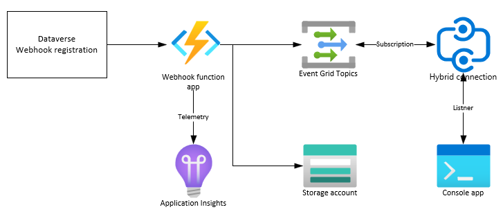
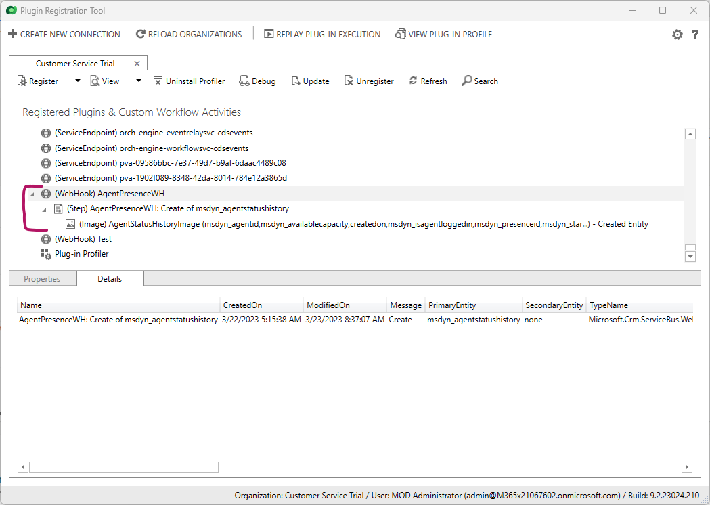
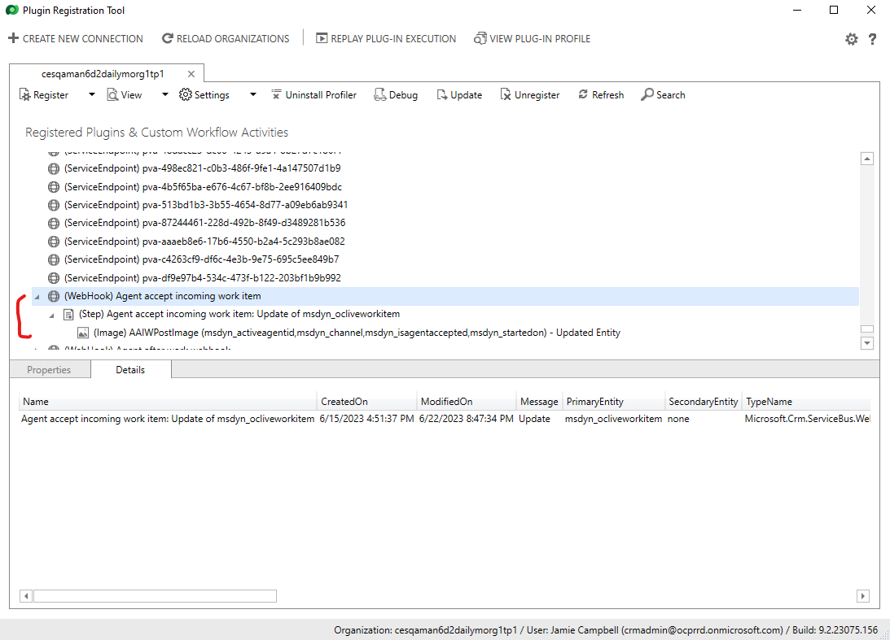
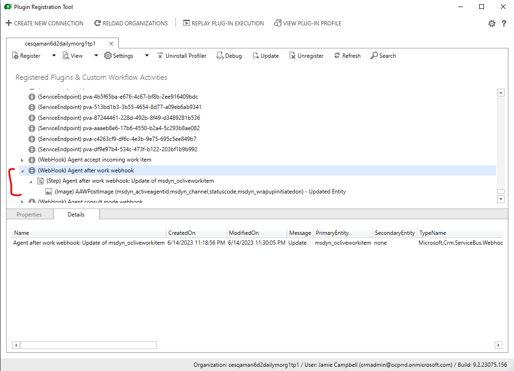
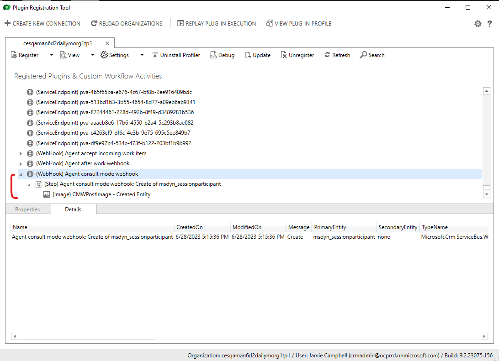

# Realtime integration with Dynamics 365 Customer Service

## In this article

- [Introduction](#introduction)
- [Demo architecture & overview](#demo-architecture--overview)
- [Setup](#setup)
  - [Create Azure resources](#create-azure-resources)
  - [Security and RBAC](#security-and-rbac)
  - [Deploy the Function App](#deploy-the-function-app)
  - [Configure webhook plugin](#configure-webhook-plugin)
- [Testing the pipeline](#testing-the-pipeline)

## Introduction

This demo shows how to integrate with Dynamics 365 Customer Service and receive near real time event updates on topics of interest, such as agent status changes, etc.

## Prerequisites

In order to run this demo, you need the following prerequisites:

- An active Dynamics 365 Customer Service org with Omni Channel installed. You must have Adminstrator permissions on this org.
- An active Azure subscription. You must have permissions to create resources in this subscription.
- [Azure CLI](https://learn.microsoft.com/azure/azure-resource-manager/bicep/install#azure-cli) installed on your local computer. Azure CLI will be used to deploy Azure resources using the supplied Bicep template, and to deploy the function app. Alternatively, you can also install [Visual Studio Code with the Bicep extension](https://learn.microsoft.com/azure/azure-resource-manager/bicep/install#vs-code-and-bicep-extension), to edit and deploy the Bicep template. The rest of this document will use Azure CLI to deploy the supplied Bicep template.
- [Power Platform CLI](https://learn.microsoft.com/power-platform/developer/cli/introduction#install-power-platform-cli-for-windows) installed on your local computer. Power Platform CLI (PAC CLI) will be used to register the webhook plugin, against your Dynamics 365 Customer Service org.

## Demo architecture & overview

The included demo demonstrates how you can consume Dynamics 365 Customer Service events in near real time. The demo shows an example of consuming agent status updates in near real time. This example may be extended to track other Dynamics 365 Customer Service events, as well.
Dynamics 365 Customer Service stores data in Dataverse. In order to consume events in near real time, you will need to setup a web hook plugin for each and every entity (table) and the corresponding CRUD event(s). The web hook will be called automatically by Dataverse, whenever the specified CRUD operation is made on the specified entity.
In our demo, the web hook has been implemented as an Azure Function. The function takes the event payload as a POST body, parses the body, and then transforms the incoming event into an object that is understood by the downstream systems. After parsing, the function can output the result into multiple output streams and in multiple formats. The demo showcases two such output streams:

- Storage Account: The data is output in an csv format to the storage account. The data is partitioned by day. This data can be consumed by any downstream systems by accessing the storage blob.
- Event Grid: The data is output in Cloud Event format. The event grid is capable of distributing events at scale to other downstream systems. We showcase one such downstream system, a hybrid connection, which in turn is connected to by a console app running on your development box, displaying events as they arrive.

The diagram below displays the setup that is created by the demo code and scripts:


## Setup

> **NOTE**
>
> The setup steps outlined below may contain step that are specific for a Windows based operating system. If you are using a non Windows operating system, then you may have to modify some of these steps, as appropriate. 

In order to run this demo, you will need to create Azure resources and configure your Dynamics 365 org. This section will outline the steps needed for the configuration.

### Create Azure resources

To create the Azure resources, we have provided [Bicep](https://learn.microsoft.com/azure/azure-resource-manager/bicep) scripts that you can run and create the resources in an automated way. In order to run the Bicep scripts, you will need to sign in to your Azure account and provide a Resource Group name and location, where the new Azure resources will be created. The Bicep scripts are located under the `azure` folder.

> **IMPORTANT**
>
> Creating Azure resources will incur cost. Different Azure resources have different cost associated with them. Please refer to the Azure billing documentation for the specific resource, to estimate costs that may be incurred. It is recommended that you delete the resources as soon as you are done with the demo, to minimize cost. Some Azure resources incur cost even if you do not use them actively.

In order to execute the scripts, open a command prompt window, navigate to the folder containing the bicep templates and execute the following command, ensuring to replace the placeholders with appropriate values:

```text
az deployment sub create --location <location> --template-file <path-to-bicep> --name <deployment-name>
```

> **NOTE**
>
> If you get an error when you run the command, then re run it. The first time you execute the command, the bicep tools will be installed by Azure CLI, and might give an error about bicep section missing. Rerunning the command will get rid of the error.

Once the command finishes running, the following Azure resources will be created in the resource group specified:

- Application Insights and its backing Log Analytics workspace.
- Function app and its backing App Service Plan.
- Relay containing the Hybrid connection.
- Event Grid topic.
- Storage account.

#### Security and RBAC

The resources will be setup with applicable permissions already assigned, via RBAC. The resources will use Managed identity to communicate with each other. The exception is Function App communication with the Event Grid, which will be setup using topic key. The console application will also subscribe to the Hybrid connection using a SAS key.
If you need to debug locally, then you should add your user account to the appropriate RBAC role in the [Azure Portal](https://portal.azure.com).

### Deploy the Function App

Once the Azure resources have been created, you will need to deploy the function app code from your local computer. To do so, open a Command Prompt window and navigate to the folder containing the Visual Studio solution file `Integration.Realtime.sln`. Run the following command to compile and publish the function app to an output folder:

```text
dotnet publish .\Integration.Realtime.Webhook\Integration.Realtime.Webhook.csproj -o <output-location> --interactive
```

Once the function app project has compiled, navigate to the output folder you specified and package the contents of the folder to a zip file. This zip file will be used for deploying the function app.

To deploy the compiled function app, we will use Azure CLI. The first step is to log in to your Azure account and select the correct subscription (in case you have multiple subscriptions associated with your account). To log in to your account, run the following command:

```text
az login
```

You will be prompted to sign in with your Azure account credentials. Once you have successfully signed in, select the correct subscription by running the following command:

```text
az account set --subscription "<subscription-name>"
```

Once the subscription has been selected, run the following command to deploy the azure function zip file that you created earlier:

```text
az functionapp deployment source config-zip -g <resource-group-name> -n <function-app-name> --src "<path-to-zip-file>"
```

Here, the `resource-group-name` should be the same name that you supplied to the bicep template when creating the Azure resources. The `function-app-name` can be found by navigating to the resource group in the [Azure Portal](https://portal.azure.com). *Be sure to enclose the `path-to-zip-file` with double quotes, incase your path has spaces in it*.

After the deployment completes successfully, your function app will be running in the cloud.

### Configure webhook plugin

The next steps will show you how to configure the webhook plugin, using Plugin Registration Tool from Power Platform CLI. Before you can register the webhook plugin, you will need the following information:

- **Function url**. This is the url to the `AgentStatus` function, that was deployed as part of the zip package earlier.
- **Function key**. This is the authentication key for calling the function app.

To retrieve both of these values, navigate to the function app in the [Azure Portal](https://portal.azure.com), and click on `Functions`. This will show all the functions in the function app. At this stage, we should have only one function listed called `AgentStatus`. Click on this function name. To retrieve the required values, do the following:

- Click on the `Get Function Url` link in the top menu, on the `Overview` tab. This will display a pop up.
- From the drop down in the pop up, select `default (function key)`. Copy the url displayed into a text editor of your choice.
- The copied url will have the following format: `https://<function-url>?code=<auth-key>`.
  - The **Function url** will be `https://<function-url>` in the copied url.
  - The **Function key** will be `<auth-key>` in the copied url.

Once you have the function url and the function key, you will register the webhook plugin using the Plugin Registration Tool (PRT). PRT is part of the PAC CLI, that you installed as part of the prerequisites. First we will ensure that the PAC CLI is up to date. To update the installed PAC CLI, open a command prompt and run the following command:

```text
pac install latest
```

Running this command will update your PAC CLI to the latest version, if applicable. Now, invoke the PRT by running the following command in the command prompt:

```text
pac tool prt
```

Running this command, will install PRT, if not already installed, and open the tool window. To register the webhook plugin, perform the following steps:

- Click on **CREATE NEW CONNECTION** button at the top of the PRT window. In the login dialog that opens up, select deployment type as **Office 365**. Click on the **Login** button.
- Enter the credentials of the user account that you want to use, when prompted. Once successfully logged in, PRT will load all the available data in the org.
- Click on **Register** > **Register New Web Hook**. The WebHook Registration dialog opens.
- In the dialog, enter the details of the webhook as follows:
  - **Name** - Enter a friendly name for the webhook. E.g. `AgentPresenceWH`.
  - **Endpoint URL** - Enter the `Function url` that you copied earlier from the Azure Portal.
  - **Authentication** - Select `WebhookKey`.
  - **Value** - Enter the `Function key` that you copied earlier from the Azure Portal. Ensure that you **do not** enter `code=` in this field, but just the value of the auth-key.
- Click on **Save** button. This will create the webhook registration.
- Right click on the registered webhook, in the `Registered Plugins & Custom Workflow Activities` list. Select **Register New Step**. The Register New Step dialog opens.
- In the dialog, enter the details of the step as follows:
  - **Message** - Select `Create`. Note: Once you start typing in this field, it will give you a drop down of the available options.
  - **Primary Entity** - Enter `msdyn_agentstatushistory`. This table contains the history of all agent presence changes, in near real time. Rows are added to this table when an agent presence changes. We will track the Create event on this table, to track the presence change, in near real time.
  - **Secondary Entity** - none.
  - **Event Handler** - The registered webhook should already be selected.
  - **Step Name** - A name will be autogenerated for you based on your selections. You may update this name to a suitable friendly name for the step, if you want.
  - **Run in User's Context** - Select an account that has Administrator privileges on the org.
  - **Execution Order** - Enter `1`.
  - **Description** - Enter a description for the step.
  - **Event Pipeline Stage of Execution** - Select `PostOperation`.
  - **Execution Mode** - Select `Asynchronous`.
  - **Deployment** - Check `Server`.
  - Check the checkbox against **Delete AsyncOperation if StatusCode = Successful**.
- Click on **Register New Step** button.
- Right click on the registered step under the webhook, and select **Register New Image**. The Register New Image dialog opens.
- In the dialog, enter the details as follows:
  - **Image Type** - Check `Post Image` checkbox. Uncheck `Pre Image`.
  - **Name** - Enter a friendly name for the step.
  - **Entity Alias** - Enter an alias for the entity, if you want.
  - **Parameters** - Click on the (...) button to select the fields. Select the following fields:
    - Agent id (msdyn_agentid)
    - availablecapacity (msdyn_availablecapacity)
    - Created On (createdon)
    - Determines if the Agent is logged in (msdyn_isagentloggedin)
    - presenceid (msdyn_presenceid)
    - starttime (msdyn_starttime)
  - Click **OK** button.
- Click on **Register Image** button to save the registration info.

Congratulations! You just registered a webhook that will be called whenever a new row is created in the msdyn_agentstatushistory table. After you finish all the steps above, your PRT window will show the following registration information:



In a similar fashion, you can include below events and tables against the webhook registration, and extend the functionality. Do not forget to update the azure function code to understand these new entities and events, and to create additional functions for new entities / events.

- **Agent accept incoming work item**



- **Agent after work**



- **Agent consult mode**



## Testing the pipeline

Once setup has been completed successfully, you will now test the pipeline, to ensure events are received in near real time. For this, we have provided a Console Application `Integration.Realtime.Client`. Before you run the client, you will need to supply the appropriate values in the `appSettings.json` file. The following values will be required, which you can get from the [Azure Portal](https://portal.azure.com):

- In Azure Portal, navigate to the resource group containing the resources that you created earlier.
- Locate the `Relay` resource type and click on it.
- On the Relay page, click on **Hybrid Connections** under the **Entities** section. This will list the hybrid connections under this relay. There should only be one connection listed. Click on the hybrid connection.
- On the overview page of the hybrid connection, copy the `Hybrid Connection Url`. It should be of the format `https://<relay-name>.servicebus.windows.net/<hybrid-connection-name>`. Make note of the values for `<relay-name>` and `<hybrid-connection-name>`.
- Click on **Shared access policies** under the **Settings** section. This will list all SAS keys for the hybrid connection. There should only be one key listed. Make a note of the name of the key policy.
- Click on the key policy name. A pane will open displaying the key values. Make a note of either the **Primary Key** or the **Secondary Key**.

Now update the `appSettings.json` file for the console application, as follows:

- **relayNamespace** - Replace `<RELAY_NAMESPACE>` with the value of the `<relay-name>` that you copied earlier.
- **hybridConnectionName** - Replace `<HYBRID_CONNECTION_NAME>` with the value of the `<hybrid-connection-name>` that you copied earlier.
- **sasKeyName** - Replace `<SAS_KEY_NAME>` with the name of the key policy that you copied earlier.
- **sasKey** - Replace `<SAS_KEY>` with the value of the key that you copied earlier.

Once you have updated the settings in the file, you will need to build the console application code. To do so, open a Command Prompt window and navigate to the folder containing the Visual Studio solution file `Integration.Realtime.sln`. Run the following command to compile and publish the console app to an output folder:

```text
dotnet publish .\Integration.Realtime.Client\Integration.Realtime.Client.csproj -o <output-location> --interactive
```

Once the console app project has compiled, navigate to the output folder you specified and run the `Integration.Realtime.Client.exe` application. The application will connect to the hybrid connection and wait for any events to arrive.

To test that the events show up in the console application, perform the following:

- Log in to Dynamics 365 Customer Service org, as an agent.
- Click on the presence icon on the top right corner. The Set Your Presence Status dialog opens.
- Set your Status and click on **OK** button. Your presence will change in the UX.
- Observe that after few seconds, the console application will display a message indicating the presence change, along with the agent name and the current state.
- You can also look in the Azure storage account that you created earlier. A csv file with today's date will be available with the presence change data.
- You can keep updating the presence status and should see corresponding output in the console app and the storage account csv file.
- Press `Enter` key to exit out of the listening mode in the console app.

Congratulations! You have successfully verified that the Presence change event has been delivered to downstream systems in near real time. Do not forget to clean up your Azure resources, after you're done, to prevent additional charges.