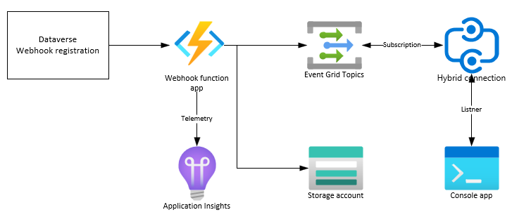
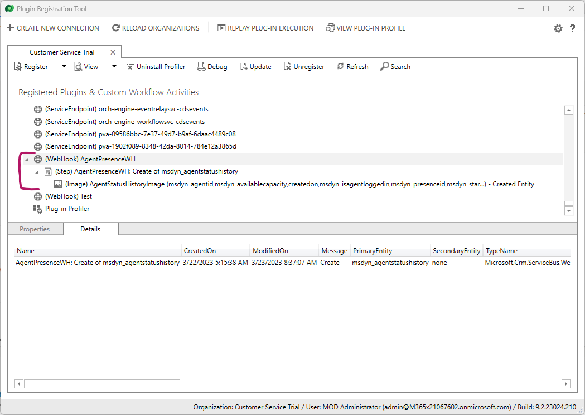
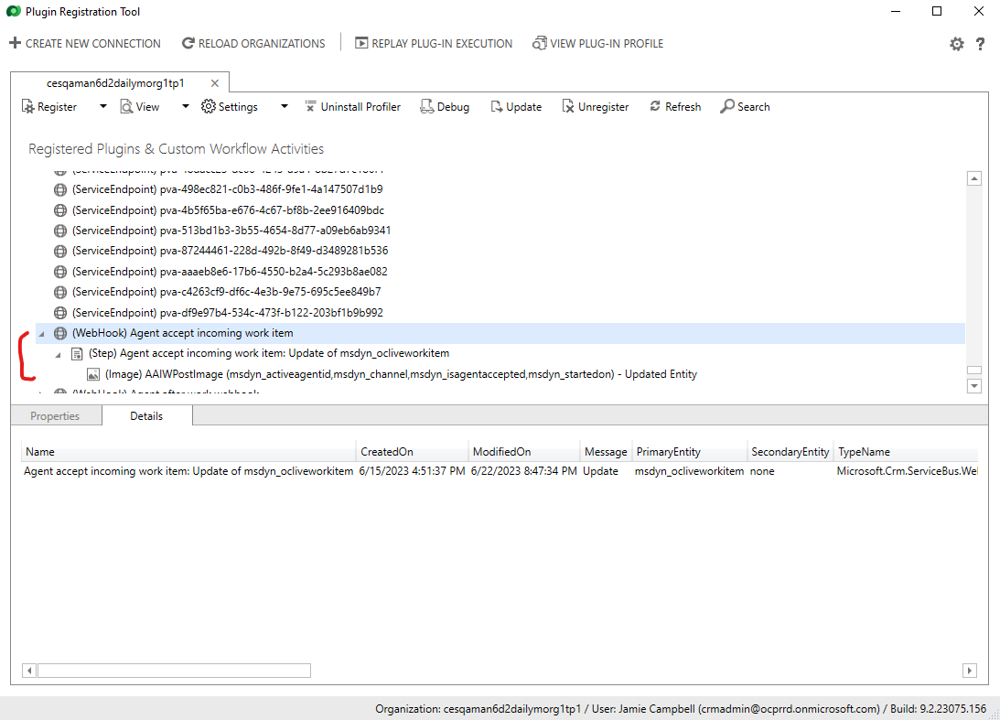
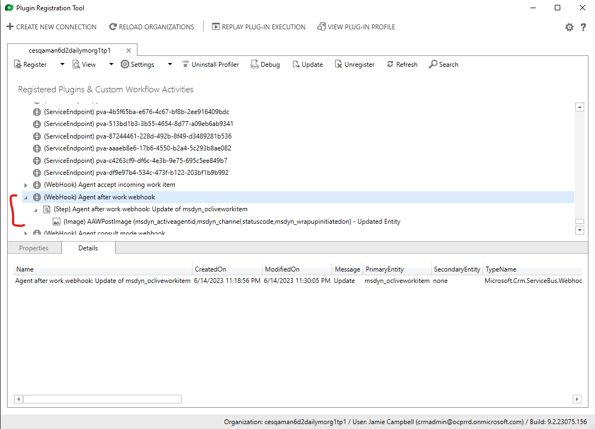
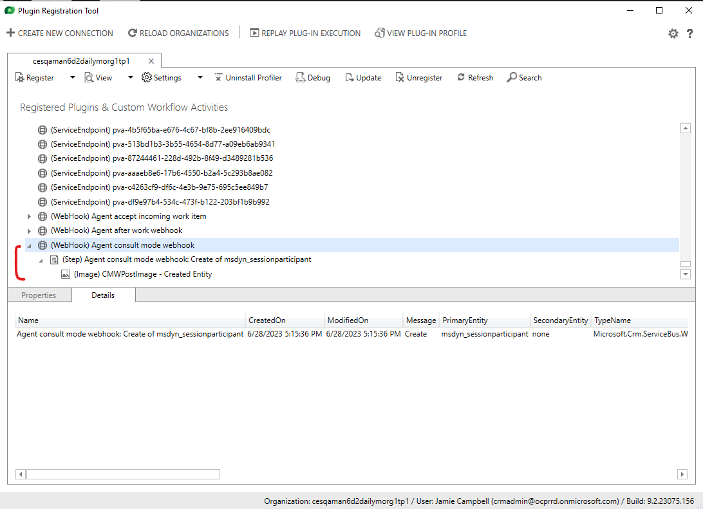

# Realtime export integration with Dynamics 365 Customer Service

## In this article

- [Introduction](#introduction)
- [Sample code](#sample-code)
- [Prerequisites](#prerequisites)
- [Demo architecture and overview](#demo-architecture-and-overview)
- [Setup](#setup)
  - [Create Azure resources](#create-azure-resources)
    - [Security and RBAC](#security-and-rbac)
  - [Deploy the Function App](#deploy-the-function-app)
  - [Configure webhook plugin](#configure-webhook-plugin)
- [Test the pipeline](#test-the-pipeline)

## Introduction

This article shows you how to integrate with Dynamics 365 Customer Service and receive near real time event updates on topics of interest, such as agent status changes.

[Return to top](#in-this-article)

## Sample code

The sample code for this topic is located in the [GitHub code repository](https://github.com/microsoft/dynamics365-customerservice-wem-samples/tree/main/src/3rdPartyIntegration/Export/Realtime) in the src/3rdPartyIntegration/Export/Realtime folder.

[Return to top](#in-this-article)

## Prerequisites

In order to run this demo, you need the following prerequisites:

- An active Dynamics 365 Customer Service org with Omnichannel installed. You must have adminstrator permissions for this org.
- An active Azure subscription with permissions to create resources in it.
- [Azure CLI](https://learn.microsoft.com/azure/azure-resource-manager/bicep/install#azure-cli) installed on your local computer. Azure CLI will be used to deploy Azure resources using the supplied Bicep template, and to deploy the function app. Alternatively, you can also install [Visual Studio Code with the Bicep extension](https://learn.microsoft.com/azure/azure-resource-manager/bicep/install#vs-code-and-bicep-extension) to edit and deploy the Bicep template. The rest of this document uses Azure CLI to deploy the supplied Bicep template.
- [Power Platform CLI](https://learn.microsoft.com/power-platform/developer/cli/introduction#install-power-platform-cli-for-windows) installed on your local computer. Power Platform CLI (PAC CLI) is used to register the webhook plugin against your Dynamics 365 Customer Service org.

[Return to top](#in-this-article)

## Demo architecture and overview

The included demo demonstrates how you can consume Dynamics 365 Customer Service events in near real time. The demo shows an example of consuming agent status updates in near real time. This example may be extended to track other Dynamics 365 Customer Service events as well.

Dynamics 365 Customer Service stores data in Dataverse. In order to consume events in near real time, you will need to setup a web hook plugin for each and every entity (table) and the corresponding CRUD event(s). The web hook will be called automatically by Dataverse, whenever the specified CRUD operation is made on the specified entity.

In our demo, the web hook is implemented as an Azure Function. This function takes the event payload as a POST body, parses the body, and then transforms the incoming event into an object that's understood by the downstream systems. After parsing, the function can output the result into multiple output streams and in multiple formats. The demo showcases two such output streams:

- Storage account: The data is output in an csv format to the storage account. The data is partitioned by day. This data can be consumed by any downstream systems by accessing the storage blob.
- Event grid: The data is output in Cloud Event format. The event grid is capable of distributing events at scale to other downstream systems. We showcase one such downstream system, a hybrid connection, which in turn is connected to by a console app running on your development box, displaying events as they arrive.

The following diagram shows the setup that's created by the demo code and scripts.



[Return to top](#in-this-article)

## Setup

 > [!NOTE]
 > The setup steps that are outlined in the following sections may contain steps that are specific for a Microsoft Windows-based operating system. If you're using a non-Windows operating system, you may have to modify some of these steps, as appropriate.

In order to run this demo, you need to create Azure resources and configure your Dynamics 365 org. This section outlines the steps needed for the configuration.

### Create Azure resources

To create the Azure resources, we've provided [Bicep](https://learn.microsoft.com/azure/azure-resource-manager/bicep) scripts that you can run and create the resources in an automated way. In order to run the Bicep scripts, you need to sign in to your Azure account and provide a resource group name and location where the new Azure resources will be created. The Bicep scripts are located in the deploy/3rdPartyIntegration/Export/Realtime/ folder.

  > [!IMPORTANT]
  > Creating Azure resources incurs cost. Different Azure resources have different costs associated with them. To estimate costs you may incur, review the Azure billing documentation. We recommended that you delete the resources as soon as you're done with the demo to minimize cost. Some Azure resources incur costs even if you don't actively use them.

To run the scripts, open a command prompt window, navigate to the folder that contains the bicep templates, and then run the following command. Make sure you replace the placeholders with the appropriate values:

```text
az deployment sub create --location <location> --template-file <path-to-bicep> --name <deployment-name>
```

 > [!NOTE]
 > If you get an error when you run the command, rerun it. The first time you execute the command, the bicep tools are installed by Azure CLI and might give an error about the bicep section missing. Rerunning the command clears the error.

After the command has run, the following Azure resources are created in the specified resource group:

- Application Insights and its backing Log Analytics workspace
- Function app and its backing App Service Plan
- Relay containing the Hybrid connection
- Event grid topic
- Storage account.

#### Security and RBAC

The resources are set up with applicable permissions already assigned via RBAC. The resources use Managed identity to communicate with each other. The exception is Function App communication with the event grid, which is set up using a topic key. The console application also subscribes to the Hybrid connection using a SAS key.
If you need to debug locally, then you should add your user account to the appropriate RBAC role in the [Azure Portal](https://portal.azure.com).

### Deploy the Function App

When the Azure resources have been created, deploy the function app code from your local computer:

1. Open a command prompt window, and then navigate to the folder that contains the Visual Studio solution file, **Integration.Realtime.sln**.
   
1. Run the following command to compile and publish the function app to an output folder:

   ```text
   dotnet publish .\Integration.Realtime.Webhook\Integration.Realtime.Webhook.csproj -o <output-location> --interactive
   ```

1. When the function app project has compiled, navigate to the output folder you specified and package the contents of the folder to a zip file. This zip file is used for deploying the function app.

1. To deploy the compiled function app, use Azure CLI. Sign in to your Azure account by running the following command and using your Azure account credentials:

   ```text
   az login
   ```

1. Select the correct subscription (in case you have multiple subscriptions associated with your account) by running the following command:

   ```text
   az account set --subscription "<subscription-name>"
   ```

1. Run the following command to deploy the Azure function zip file that you created earlier:

   ```text
   az functionapp deployment source config-zip -g <resource-group-name> -n <function-app-name> --src "<path-to-zip-file>"
   ```

   Here, the **resource-group-name** should be the same name that you entered in the bicep template when creating the Azure resources. The **function-app-name** is found by navigating to the resource group in the [Azure Portal](https://portal.azure.com). *Be sure to enclose the **path-to-zip-file** with double quotes, in case your path has spaces in it*.

After the deployment completes successfully, your function app runs in the cloud.

### Configure the webhook plugin

The next steps show you how to configure the webhook plugin using the Plugin Registration Tool from Power Platform CLI. 

Before you can register the webhook plugin, you need the following information:

- **Function url**. This is the URL to the `AgentStatus` function that was deployed as part of the zip package earlier.
- **Function key**. This is the authentication key for calling the function app.

To retrieve both of these values, perform the following steps:

1. Navigate to the function app in the [Azure Portal](https://portal.azure.com), and then select **Functions**. This shows all the functions in the function app.

1. At this stage, there should be only one function listed, called AgentStatus. Select this function name.

1. To retrieve the required values, do the following:

   - Select the **Get Function Url** link in the top menu on the **Overview** tab. This displays a popup.
   - From the dropdown in the popup, select **default (function key)**. Copy the URL that's shown into a text editor of your choice.
   - The copied URL has the following format: `https://<function-url>?code=<auth-key>`.
     - The **Function url** is `https://<function-url>` in the copied URL.
     - The **Function key** is `<auth-key>` in the copied URL.

Register the webhook plugin using the Plugin Registration Tool (PRT). PRT is part of the PAC CLI that you installed as part of the prerequisites. 

1. Ensure that the PAC CLI is up to date. To update the installed PAC CLI, open a command prompt and run the following command:

   ```text
   pac install latest
   ```

     Running this command updates your PAC CLI to the latest version, if applicable. 

1. Next, invoke the PRT by running the following command in the command prompt:

   ```text
   pac tool prt
   ```

   Running this command installs PRT if it's not already installed, and opens the tool window.

To register the webhook plugin, perform the following steps:

1. Select **CREATE NEW CONNECTION** at the top of the PRT window. In the login dialog that opens, select the **Office 365** for the deployment type, then then select **Login**.
   
1. When prompted, enter the credentials of the user account that you want to use. When successfully signed in, PRT loads all the available data in the org.
   
1. Select **Register** > **Register New Web Hook**. The WebHook Registration dialog opens.

1. In the dialog, enter the details of the webhook as follows:
     - **Name** - Enter a friendly name for the webhook. E.g. `AgentPresenceWH`.
     - **Endpoint URL** - Enter the `Function url` that you copied earlier from the Azure Portal.
     - **Authentication** - Select `WebhookKey`.
     - **Value** - Enter the `Function key` that you copied earlier from the Azure Portal. Ensure that you **do not** enter `code=` in this field, but just the value of the auth-key.
    
1. Select **Save**. This creates the webhook registration.
   
1. Right-click the registered webhook in the **Registered Plugins & Custom Workflow Activities** list. Select **Register New Step**. The **Register New Step** dialog opens.
   
1. In the dialog, enter the details of the step as follows:
     - **Message**: Select **Create**. Note: When you start typing in this field, it gives you a dropdown menu of the available options.
     - **Primary Entity**: Enter `msdyn_agentstatushistory`. This table contains the history of all agent presence changes, in near real time. Rows are added to this table when an agent presence changes. You'll track the Create event on this table to track the presence change in near real time.
    - **Secondary Entity**: none.
    - **Event Handler**: The registered webhook should already be selected.
    - **Step Name**: A name is autogenerated for you based on your selections. You can update this name to a suitable friendly name if preferred.
     - **Run in User's Context**: Select an account that has administrator privileges for the org.
     - **Execution Order**: Enter 1.
     - **Description**: Enter a description for the step.
     - **Event Pipeline Stage of Execution**: Select **PostOperation**.
     - **Execution Mode**: Select **Asynchronous**.
     - **Deployment** - Select **Server**.

1. Select the checkbox for **Delete AsyncOperation if StatusCode = Successful**.

1. Select **Register New Step**.

1. Right-click the registered step under the webhook, and then select **Register New Image**. The **Register New Image** dialog opens.

1. In the dialog, enter the details as follows:
     - **Image Type** - Check `Post Image` checkbox. Uncheck `Pre Image`.
     - **Name** - Enter a friendly name for the step.
     - **Entity Alias** - Enter an alias for the entity, if you want.
     - **Parameters** - Click on the (...) button to select the fields. Select the following fields:
       - Agent id (msdyn_agentid)
       - availablecapacity (msdyn_availablecapacity)
       - Created On (createdon)
       - Determines if the Agent is logged in (msdyn_isagentloggedin)
       - presenceid (msdyn_presenceid)
       - starttime (msdyn_starttime)

1. Select **OK**.

1. Select **Register Image** to save the registration info.

Congratulations! You just registered a webhook that will be called whenever a new row is created in the msdyn_agentstatushistory table. After you finish all the preceding steps, your PRT window shows the following registration information:



Similarly, you can include the following events and tables against the webhook registration, and extend the functionality. Don't forget to update the Azure function code to understand these new entities and events, and to create additional functions for new entities and events.

- **Agent accept incoming work item**

  

- **Agent after work**

  

- **Agent consult mode**

  

[Return to top](#in-this-article)

## Test the pipeline

When the setup has successfully completed, you'll test the pipeline to ensure that events are received in near real time. To complete the test, we've provided a Console Application `Integration.Realtime.Client`. Before you run the client, you need to supply the appropriate values in the `appSettings.json` file. The values in this section are required.

1. In the [Azure Portal](https://portal.azure.com), navigate to the resource group that contains the resources you created previously.
   
1. Locate and select the **Relay** resource type.

1. On the **Relay** page, select **Hybrid Connections** under the **Entities** section. There should be a single hybrid connection listed under this relay.

1. Select the hybrid connection, and then on the overview page, copy the **Hybrid Connection Url**. It should be in the following format `https://<relay-name>.servicebus.windows.net/<hybrid-connection-name>`. Make note of the values for `<relay-name>` and `<hybrid-connection-name>`.

1. Select **Shared access policies** under the **Settings** section. This lists all SAS keys for the hybrid connection. There should only be one key listed. Make a note of the name of the key policy.

1. Select the key policy name. A pane opens and displays the key values. Make a note of either the **Primary Key** or the **Secondary Key**.

1. Update the **appSettings.json** file for the console application as follows:
   - **relayNamespace** - Replace `<RELAY_NAMESPACE>` with the value of the `<relay-name>` that you copied earlier.
   - **hybridConnectionName** - Replace `<HYBRID_CONNECTION_NAME>` with the value of the `<hybrid-connection-name>` that you copied earlier.
   - **sasKeyName** - Replace `<SAS_KEY_NAME>` with the name of the key policy that you copied earlier.
   - **sasKey** - Replace `<SAS_KEY>` with the value of the key that you copied earlier.

1. Build the console application code: Open a command prompt window, and then navigate to the folder that contains the Visual Studio solution file, **Integration.Realtime.sln**.

1. Run the following command to compile and publish the console app to an output folder:

   ```text
   dotnet publish .\Integration.Realtime.Client\Integration.Realtime.Client.csproj -o <output-location> --interactive
   ```

1. When the console app project has compiled, navigate to the output folder you specified and run the **Integration.Realtime.Client.exe** application. The application connects to the hybrid connection and waits for any events to arrive.

To test that the events show up in the console application, perform the following steps:

1. Sign in to your Dynamics 365 Customer Service org as an agent.

1. Select the presence icon in the top-right corner. The **Set Your Presence Status** dialog opens.

1. Set your status, and then select **OK**. Your presence changes in the interface.

1. Observe that after few seconds, the console application displays a message that indicates the presence change, along with the agent name and the current state.
   You can also look in the Azure storage account that you created earlier. A csv file with today's date will be available with the presence change data.You can keep updating the presence status and should see corresponding output in the console app and the storage account csv file.

1. Press the **Enter** key to exit the listening mode in the console app.

Congratulations! You've successfully verified that the Presence change event was delivered to downstream systems in near real time. 

Don't forget to clean up your Azure resources after you're done to prevent additional charges.

[Return to top](#in-this-article)
