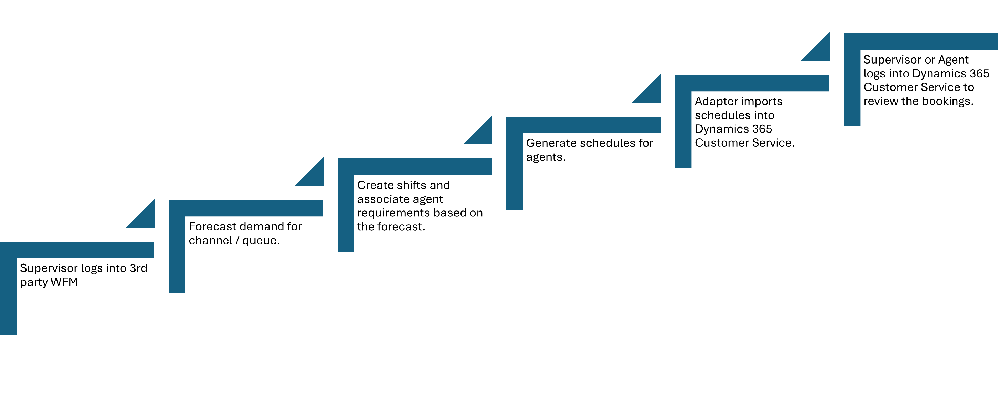

# Import integration with Dynamics 365 Customer Service

## In this article

- [Introduction](#introduction)
- [High level overview](#high-level-overview)
- [Steps to import bookings](#steps-to-import-bookings-from-3rd-party-system)
- [Data model](#data-model)
  - [Bookable Resource](#bookable-resource-bookableresource)
    - [Bookable Resource - Resource Type](#bookable-resource---resource-type)
  - [Booking Status](#booking-status-bookingstatus)
    - [Booking Status - Status](#booking-status---status)
  - [Resource Schedule Source](#resource-schedule-source-msdyn_resourceschedulesource)
  - [Shift Assignment Status](#shift-assignment-status-msdyn_shiftassignmentstatus)
  - [Shift Activity Type](#shift-activity-type-msdyn_shiftactivitytype)
  - [Shift Plan](#shift-plan-msdyn_shiftplan)
  - [Booking Setup Metadata](#booking-setup-metadata-msdyn_bookingsetupmetadata)
  - [Bookable Resource Booking](#bookable-resource-booking-bookableresourcebooking)
    - [Bookable Resource Booking - Booking Type](#bookable-resource-booking---booking-type)
- [Viewing imported bookings](#viewing-imported-bookings)

## Introduction

Supervisors use Demand forecasting to estimate the number of agents required to meet the forecasted incoming support requests. Using this estimation, supervisors can schedule agents based on various attributes, such as channels, queues, skills etc. Dynamics 365 for Customer Service provides an easy way to integrate with 3rd party scheduling systems, by allowing users to schedule agents in the 3rd party systems and providing an ability to import the schedules back to Dynamics 365 for Customer Service. Once imported, the schedules may be used to set up routing rules in Dynamics 365 for Customer Service, to provide a seamless integration between the schedules authored in 3rd party systems and routing system in Dynamics.

The following diagram shows the high-level flow of the scenario:

This article will outline the data model in Dynamics 365 for Customer Service, which will be able to support the imported schedules from any arbitrary 3rd party scheduling systems.

[Return to top](#in-this-article)

## High level overview

At a high level, each Agent works in a shift. A shift represents the total amount of time that the agent is available for performing various activities. A shift is composed of one or more bookings, which represents a finite time duration within the shift, in which the agent performs the assigned task.
The crow feet diagram below shows a high-level overview of the various entities and their relationships, as it applies to importing schedules from 3rd party systems to Dynamics 365 for Customer Service:

The [Bookable Resource Booking](#bookable-resource-booking-bookableresourcebooking) entity stores all the imported bookings from the 3rd party scheduling system. Each booking relates to a [Bookable Resource](#bookable-resource-bookableresource) (in this case an Agent). The Bookable Resource is identified by the **resource** column in the Bookable Resource Booking entity. The booking also identifies the type of work that that agent will perform as part of the booking, via the **msdyn_shiftactivitytype** column. This column is a lookup on the [Shift Activity Type](#shift-activity-type-msdyn_shiftactivitytype) entity, which describes the work.

Additionally, the booking also identifies the [Shift Plan](#shift-plan-msdyn_shiftplan), via the **msdyn_shiftplan** column. Shift Plan is a logical grouping of bookings. This helps users focus on bookings that are only related to the specific shift. For the 3rd party import, it is recommended that all imported bookings should be assigned to a shift plan. Multiple shift plans may be created, as appropriate.

Finally, the booking identifies a [Booking Setup Metadata](#booking-setup-metadata-msdyn_bookingsetupmetadata). The booking setup metadata identifies all bookings that are part of the Workforce Engagement Management system. The booking setup metadata entity has an entry of type of “msdyn_shiftplan” **that must be assigned to all bookings originating in the WEM system, which includes 3rd party imported bookings**. *This helps filter bookings that are not part of 3rd party import / WEM*.

[Return to top](#in-this-article)

## Steps to import bookings from 3rd party system

This section outlines the process and steps to import bookings from any arbitrary 3rd party system. The steps outline the sequence of entity creation that will need to happen, which will lead to a successful creation of an imported booking.

> **NOTE**
> To create the objects in Dataverse, you will need to either use the [Organization Service](https://learn.microsoft.com/power-apps/developer/data-platform/org-service/overview) or the [Dataverse OData Web API](https://learn.microsoft.com/power-apps/developer/data-platform/webapi/overview). The method that you choose to interact with Dataverse objects will be dependent on your individual design and implementation, among other factors. Microsoft does not make a recommendation of using one method over the other. **This document expects that you are familiar with at least one of these methods for interacting with Dataverse objects**.

1. Ensure that you have a user created for each agent, in Dynamics 365. To create a user, follow these steps:

   1. Navigate to the Power Platform admin center for your organization.

   1. Click on **Settings**. Under **Users + permissions**, click on **Users**.

   1. Click on **Add user**. Search for the user’s name or email address. The user should already exist in 
   the Azure Active Directory associated with the org.

   1. Once you select the user, click on the **Add** button.

   1. Next assign the user to the appropriate role(s).

   1. For more information on adding and assigning roles to users, please visit this [link](https://learn.microsoft.com/dynamics365/customer-service/overview-users).

   > **NOTE**
   > It is recommended that you pre create users in Dynamics 365, to reflect that in the 3rd party system. This is a one-time setup and should only be repeated when adding additional new agents.

1. Next you will need to create a bookable resource entity for the user. The bookable resource needs to be created, whenever the incoming import payload contains an agent that does not have a matching bookable resource (agent) in Dynamics 365. To create the bookable resource, ensure that you understand the [Bookable Resource](#bookable-resource-bookableresource) schema and the required fields to create an entry. The following fields will need to be hydrated:

   1. **name** – Set this to the name of the agent. Ideally, this should match with the name of the agent defined in the 3rd party system, and the corresponding user created in Dynamics 365 (Step 1).

   1. **resourcetype** – Set this to “User”. This is an option set value.

   1. **userid** – Set this to the id of the corresponding user that you created earlier in Step 1. This is a lookup field on the User entity.

1. Create the shift activity types, according to the defined activity types in the 3rd party system. The shift activity type defines the type of work to be performed as part of the booking. The shift activity type needs to be created, whenever the incoming import payload contains an activity type that does not have a matching type in Dynamics 365. To create a shift activity type, ensure that you understand the [Shift Activity Type](#shift-activity-type-msdyn_shiftactivitytype) schema and the required fields to create an entry. The following fields will need to be hydrated:

   1. **msdyn_name** – Set this to the name of the activity type. Ideally, this should be set to the activity types that are defined in the 3rd party system.

   1. **msdyn_shiftassignmentstatus** – Set this to a status value to indicate if the agent is available to take incoming messages, when assigned to a shift with this status. For example, when the agent is assigned to a shift type of `Lunch`, they should be marked as `Not Available`, since they will not be able to take incoming messages while on lunch. This is an option set value.

1. Create the Booking Statuses. Booking status allows you to create multiple sub statuses, that are defined in the 3rd party system, and map it to a built-in booking status. A booking status needs to be created whenever the incoming import payload contains a status that does not have a matching status in Dynamics 365. To create a booking status entry, ensure that you understand the [Booking Status](#booking-status-bookingstatus) schema and the required fields to create an entry. The following fields will need to be hydrated:

   1. **name** – Set this to the name of the booking status. Ideally, this name should be set to the statuses defined in the 3rd party system.

   1. **status** – Set this to the built in status to map to. For imported bookings, it is recommended that this be set to `Committed`, since the adapter should only import bookings that are committed. This is an option set value.

1. *Optional*. Create the [Shift Plan](#shift-plan-msdyn_shiftplan). A Shift Plan is a logical grouping of bookings. Ideally, the shift plan should come from the 3rd party system or be calculated by the adapter during import, based on known attributes. A shift plan needs to be created whenever the incoming import payload contains a shift plan that does not have a matching plan in Dynamics 365. All imported bookings should be assigned to a shift plan. To create the entity, ensure that you understand the schema. Create the entry by setting the **msdyn_name** field to an appropriate value.

1. Finally create the booking which is represented by the [Bookable Resource Booking](#bookable-resource-booking-bookableresourcebooking) entity. To create the entity, ensure that you understand the schema. You will need to pull in lookups on other entities, to stitch together the booking entity, as mentioned below:

   1. **starttime** – Set this to the start time of the booking. This information will come from the 3rd party system that the booking information is being imported from.

   1. **endtime** – Set this to the end time of the booking. This information will come from the 3rd party system that the booking information is being imported from.

   1. **resource** – Set this to the resource that is being booked, as part of the imported booking. This is a lookup field, on the [Bookable Resource](#bookable-resource-bookableresource) entity. You will need to look up the incoming resource, by an attribute such as Name, in the Bookable Resource entity. Once you have located the correct entry, use the value of the **bookableresourceid** field of that entry.

   1. **bookingtype** – This is a choice value, indicating if the booking is firm and cannot be cancelled or not. For 3rd party imports, it is recommended that this value be set to `Solid` (choice value 1).

   1. **bookingstatus** – Set this to the status of the booking as mentioned in the 3rd party system. You would already have created the status in Step 4. This is a lookup field, on the [Booking Status](#booking-status-bookingstatus) entity. You will need to look up the incoming status, by Name, in the Booking Status entity. Once you have located the correct entry, use the value of the ***bookingstatusid*** field of that entry.

   1. **msdyn_bookingmethod** – This is a choice value, indicating the source of the booking. For the 3rd party import, it is recommended that it be set to `Manual` (choice value 690970003).

   1. **name** – Set this to a string representing the booking. This information may potentially come from the 3rd party system or may be calculated during import.

   1. **msdyn_shiftactivitytype** – Set this to the type of the activity that will be performed by the agent as part of the booking. This information will come from the 3rd party system that the booking information is being imported from. This is a lookup field on the [Shift Activity Type](#shift-activity-type-msdyn_shiftactivitytype) entity. You would already have created the activity type in Step 3. You will need to look up the activity type, by msdyn_name, in the Shift Activity Type entity. Once you have located the correct entry, use the value of the ***msdyn_shiftactivitytypeid*** field of that entry.

   1. **msdyn_shiftplan** – This represents the logical group of the booking. If you have not created a shift plan earlier, you may leave this as empty. This is a lookup field, on the [Shift Plan](#shift-plan-msdyn_shiftplan) entity. You will need to look up the plan, by msdyn_description, in the Shift Plan entity. Once you have located the correct entry, use the value of the ***msdyn_shiftplanid*** field of that entry.

   1. **msdyn_bookingsetupmetadataid** – Set this to the setup metadata that represents the WEM / 3rd party imported bookings. This is a lookup field on the [Booking Setup Metadata](#booking-setup-metadata-msdyn_bookingsetupmetadata) entity. The entry in the Booking Setup Metadata entity that represents WEM / 3rd party imported bookings will be created for you as part of the package installation. **You do not need to create the setup metadata**. The Booking Setup Metadata record for WEM / 3rd party imported bookings has an id of `4beb9fdb-48e9-453f-b008-5862ff902c5d`. Use this value for all imported 3rd party bookings.

[Return to top](#in-this-article)

## Data model

The following sections will outline the various entity (table) schema associated with the schedule import feature.

[Return to top](#in-this-article)

### Bookable Resource (`bookableresource`)

Entity **bookableresource** is an existing entity. This entity represents a resource that can be booked for a finite time. Agent is one such bookable resource.

The following attributes are of interest:

| Display Name (*Logical name*) |Value type |Description|
|-------------------------------|-----------|-----------|
|Name (*name*) |Single line text|The name of the bookable resource.|
|Resource Type (*resourcetype*) |Local choice - [Resource type](#bookable-resource---resource-type)|The type of resource being booked. Agents are of type **User**.|
|Bookable Resource (bookableresourceid) | Unique identifier|The id of the bookableresource row.|
|User (userid)| Lookup on the User entity | The underlying user identified by this bookable resource.|

#### Bookable Resource - Resource Type

The table below outlines the possible values for the **Resource Type** column.

| Choice name | Choice value |
|-------------|:------------:|
| Generic     | 1            |
| Contact     | 2            |
| User        | 3            |
| Equipment   | 4            |
| Account     | 5            |  
| Crew        | 6            |
| Facility    | 7            |
| Pool        | 8            |

[Return to top](#in-this-article)

### Booking Status (`bookingstatus`)

Entity **bookingstatus** is an existing entity. This entity allows the creation of multiple sub statuses mapped to a booking status option. The booking statuses are of the following types:

1. **Proposed** – Indicates that the booking is proposed and not finalized.
1. **Committed** - Indicates that the booking has been finalized and committed.
1. **Canceled** - Indicates that the booking has been cancelled and no longer committed.

> **NOTE**
> As part of this feature, only committed and finalized bookings should be imported to Dynamics 365 for Customer Service.

The following attributes are of interest:

| Display Name (*Logical name*) |Value type |Description|
|-------------------------------|-----------|-----------|
|Name (*name*) |Single line text|The name of the booking status.|
|Booking Status (*bookingstatusid*) |Unique identifier|The id of the bookingstatus row.|
|Status (*status*) |Local choice - [Status](#booking-status---status)|The status of the booking. These are the core booking statuses that the defined sub statuses are mapped to.|

#### Booking Status - Status

The table below outlines the possible values for the **Status** column.

| Choice name | Choice value |
|-------------|:------------:|
| Proposed    | 1            |
| Committed   | 2            |
| Canceled    | 3            |

[Return to top](#in-this-article)

### Resource Schedule Source (`msdyn_resourceschedulesource`)

Choice **msdyn_resourceschedulesource** is an existing global choice. This choice indicates the source of the booking.

The following values are available as part of the choice:

| Choice name                      | Choice value |
|----------------------------------|:------------:|
| Resource Scheduling Optimization | 192350000    |
| Schedule Board                   | 690970001    |
| Mobile                           | 690970002    |
| Manual                           | 690970003    |
| Schedule Assistant               | 690970004    |

[Return to top](#in-this-article)

### Shift Assignment Status (`msdyn_shiftassignmentstatus`)

Choice **msdyn_shiftassignmentstatus** is a ***new*** global choice that is being introduced as part of this feature. This choice indicates whether the agent can be routed incoming requests as part of the shift assignment.

The following values are available as part of the choice:

| Choice name   | Choice value |
|---------------|:------------:|
| Available     | 192350000    |
| Not available | 192350001    |

[Return to top](#in-this-article)

### Shift Activity Type (`msdyn_shiftactivitytype`)

Entity **msdyn_shiftactivitytype** is a ***new*** entity being introduced as part of this feature. This entity represents the kind of activity the agent is booked for. Typically, these values are configured in the 3rd party system based on business need. Examples are Working, Lunch, Training etc.

The following attributes are of interest:

| Display Name (*Logical name*) |Value type |Description|
|-------------------------------|-----------|-----------|
|Name (*name*) |Single line text|The name of the activity type. This value should ideally be configured in the 3rd party system and copied during the import.|
|Assignment Status (*msdyn_shiftassignmentstatus*) |Global choice - [Shift Assignment Status](#shift-assignment-status-msdyn_shiftassignmentstatus)|The routing assignment status. This indicates if the agent will be routed with an incoming request or not. The incoming request will only be routed if the assignment status is marked as Available.|
|Shift Activity Type (*msdyn_shiftactivitytypeid*) |Unique identifier|The id of the msdyn_shiftactivitytype row.|

[Return to top](#in-this-article)

### Shift Plan (`msdyn_shiftplan`)

Entity **msdyn_shiftplan** is a new entity being introduced as part of this feature. This entity represents the plan for the assigned shift for the agent.

The following attributes are of interest:

| Display Name (*Logical name*) |Value type |Description|
|-------------------------------|-----------|-----------|
|Name (*msdyn_name*) |Single line text|Name for the shift plan.|
|Shift Plan (*msdyn_shiftplanid*) |Unique identifier|The id of the msdyn_shiftplan row.|

[Return to top](#in-this-article)

### Booking Setup Metadata (`msdyn_bookingsetupmetadata`)

Entity **msdyn_bookingsetupmetadata** is an existing entity. This entity represents a set of settings that relates to a type of booking. For WEM / 3rd party imported bookings, a setup metadata with id (msdyn_bookingsetupmetadataid) equal to `4beb9fdb-48e9-453f-b008-5862ff902c5d` is available in this entity and should be used for all 3rd party imported bookings. This setup metadata entry will be created by the package import and will not have to be created separately.

The following attributes are of interest:

| Display Name (*Logical name*) |Value type |Description|
|-------------------------------|-----------|-----------|
|Entity Logical Name (*msdyn_entitylogicalname*)|Single line text |The name of the custom entity for which these settings apply. NOTE: For 3rd party import, the custom entity will be called `msdyn_shiftplan`.|
|Available Duration Minimum(%) (*msdyn_availabledurationminimumpercentage*)|Whole number |The percentage of time that the agent is available.|
|Booking Relationship Logical Name (*msdyn_bookingrelationshiplogicalname*)|Single line text |An identifier that links bookings to a scheduling entity.|
|Booking Setup Metadata (*msdyn_bookingsetupmetadataid*)|Unique identifier |The id of the msdyn_bookingsetupmetadata row. For 3rd party import, the id will be `4beb9fdb-48e9-453f-b008-5862ff902c5d`. All imported records must reference this id for the booking setup metadata field.|
|Default Booking Canceled Status (*msdyn_defaultbookingcanceledstatus*)|Lookup on [Booking Status](#booking-status-bookingstatus) entity. |The default booking cancelled status.|
|Default Booking Committed Status (*msdyn_defaultbookingcommittedstatus*)|Lookup on [Booking Status](#booking-status-bookingstatus) entity. |The default booking committed status.|
|Default Booking Duration (*msdyn_defaultbookingduration*)|Whole number |The default booking duration.|
|Requirement Relationship Logical Name (*msdyn_requirementrelationshiplogicalname*)|Single line text |An identifier that links requirements to a scheduling entity.|

[Return to top](#in-this-article)

### Bookable Resource Booking (`bookableresourcebooking`)

Entity **bookableresourcebooking** is an existing entity. This entity represents a booking of an existing bookable resource.

The following attributes are of interest:

| Display Name (*Logical name*) |Value type |Description|
|-------------------------------|-----------|-----------|
|Resource (*resource*)|Lookup on [Bookable Resource](#bookable-resource-bookableresource) entity |The resource that is being booked.|
|Start Time (*starttime*)|Date and time |The start date and time of the booking.|
|End Time (*endtime*)|Date and time |The end date and time of the booking.|
|Booking Type (*bookingtype*)|Local choice - [Booking Type](#bookable-resource-booking---booking-type) |Indicates whether the booking is solid or liquid. `Solid` bookings are firm and cannot be changed whereas `Liquid` bookings can be changed.|
|Booking Status (*bookingstatus*)|Lookup on [Booking Status](#booking-status-bookingstatus) entity |The status of the booking.|
|Bookable Resource Booking (*bookableresourcebookingid*)|Unique identifier |The id of the bookableresourcebooking row.|
|Booking Method (*msdyn_bookingmethod*)|Global choice - [Resource Schedule Source](#resource-schedule-source-msdyn_resourceschedulesource) |The method used to create this booking.|
|Name (*name*)|Single line text |The name of the booking.|
|Shift Activity Type (*msdyn_shiftactivitytype*)|Lookup on [Shift Activity Type](#shift-activity-type-msdyn_shiftactivitytype) entity |The activity type of the shift associated with the booking.|
|Shift Plan (*msdyn_shiftplan*)|Lookup on [Shift Plan](#shift-plan-msdyn_shiftplan) entity |The shift plan associated with the booking.|
|Booking Setup Metadata (*msdyn_bookingsetupmetadataid*)|Lookup on [Booking Setup Metadata](#booking-setup-metadata-msdyn_bookingsetupmetadata) entity |The booking setup metadata (bsm) associated with the booking. This field should be set to the bsm entity, having id of `4beb9fdb-48e9-453f-b008-5862ff902c5d` for all 3rd party imported bookings.|

#### Bookable Resource Booking - Booking Type

The table below outlines the possible values for the **Booking Type** column.

| Choice name | Choice value |
|-------------|:------------:|
| Solid       | 1            |
| Liquid      | 2            |

[Return to top](#in-this-article)

## Viewing imported bookings

After the import, supervisors can view the imported bookings in Customer Service workspace, by selecting the **Shift Bookings** sitemap menu item, in the left hamburger menu. **Note that this menu item is ONLY available to users with the supervisor role**.

Agents can view their own bookings through the Booking calendar. The Booking calendar can be accessed in Customer Service Workspace via the **My Schedule** sitemap menu.

[Return to top](#in-this-article)
